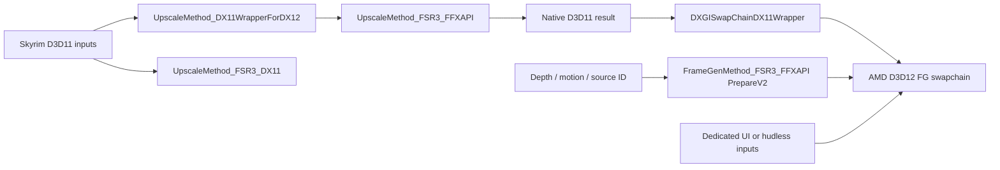

# AIO Build 18 FSR reverse-engineering notes

Date: 2026-10-01. Scope: offline static inspection requested by the user, using Ghidra 12.1.3 and Capstone 5.0.7. This is evidence for integration decisions, not source transplanted into TRP or a gameplay acceptance result.

## Binary identity and method

Input: `C:/Users/user/Downloads/SkyrimUpscalerAIOBuild18-Hotfix1.7z` (204,178,443 bytes).
Archive SHA-256: `136cbacda0d75373ad47e07c6017924edaaddbda063abaeb53f7e30734076af8`.

| File | SHA-256 | File version observed locally |
| --- | --- | --- |
| `SKSE/Plugins/SkyrimUpscaler.dll` | `5ded74be9bccefe4cff12cdd93e87cd079c017b0500dd1c5ec3150eaf08f7f81` | 1.0.2.0 |
| `UpscalerBasePlugin/PDPerfPlugin.dll` | `53b5068c01700aa1c6d551fce3827cf23f0cc3cf9f543737e6c6166a2ff441d1` | No file version resource observed |
| `amd_fidelityfx_loader_dx12.dll` | `2f36843c3bb8c059621c10574e586a883ef337f2a549c67ecf3a82b3959ac238` | 2.1.0.604 |
| `amd_fidelityfx_framegeneration_dx12.dll` | `3f5e674a59b400756e98ef31fd583a4eb08ad567ec8dee362886bc96e55ed347` | 4.0.0.604 |
| `amd_fidelityfx_upscaler_dx12.dll` | `2604c0b392072d715b400b2f89434274de31995a4b6e68ce38250ebbd3f6c5fc` | 4.0.2.0 |

The archive also supplies a legacy D3D11 backend (`ffx_backend_dx11_x64.dll`, `ffx_fsr3upscaler_x64.dll`, `ffx_fsr3_x64.dll`) and multiple NVIDIA/Intel runtimes. Local Authenticode inspection reports a valid signature on the AMD loader/FG DLLs above, and NotSigned on the supplied upscaler/monolithic/legacy DLLs. These observations do not establish their provenance or actual selected providers. TRP's plan retains the official SDK 2.3.0 pin; its runtime package and per-DLL hashes still require local verification during implementation.

7-Zip extracted files only to ignored research output. PE import/export/section metadata, focused strings, `.pdata` bounds, decoded RIP references, RTTI vtables, and targeted decompilation were examined. Capstone candidates were decoded before recording them; Ghidra independently recovered the named backend classes and virtual methods. Some main-plugin regions produced decompiler warnings; no claim of complete game-hook recovery is made.

Ghidra imported/decompiled `SkyrimUpscaler.dll` and `PDPerfPlugin.dll` successfully. The initial main-plugin pass covered 21 string-linked functions; the helper passes covered 54 selected functions and 87 vtable/helper targets, followed by focused wrapper/callback inspection. All target addresses below are RVAs in the exact `PDPerfPlugin.dll` hash above, image base `0x180000000`. They are not universal hook addresses.

No supplied DLL was executed, no live process was attached, and no executable, installed game, MO2 profile, or renderer setting was patched. The initial publication contained only these authored notes. At the user's subsequent request to push all research and make an RE database, static evidence, analysis reports/decompilation, and tools were published under `research/`; original runtime binaries remain excluded. See the [plain RE database](RE_DATABASE.md).

## Architecture recovered

The FSR implementation is primarily in `PDPerfPlugin.dll`; the main plugin supplies game integration and UI/configuration. Its exported `EvaluateUpscaler` and `EvaluateFrameGeneration` delegate to separate virtual slots on an API owner, rather than implementing the algorithms in their export bodies.

The diagram summarizes static class/call/resource relationships; it does not assert that every combination is valid or that a particular runtime path was exercised.

| Role | RVA / static evidence |
| --- | --- |
| Dynamic FFX API acquisition | `0xcc8c0`: GetModuleHandleW/GetProcAddress for the five API functions, with separate tables for monolithic, loader, and graphics API variants. |
| Active function-table selection | `0xccc80`: selects a table by graphics API and backend selection; D3D12 selection 4 chooses the loader table. |
| D3D11 legacy FSR creation/dispatch | `0xfe2e0` / `0xfedc0`: backend interface/context creation and `ffxFsr3ContextDispatchUpscale` resource assembly. |
| D3D12 wrapper constructor/evaluation | `0xcf080` / `0xd0cb0`: RTTI `UpscaleMethod_DX11WrapperForDX12`, shared-resource work and inner upscaler dispatch. Vtable at `0x11a82d8`. |
| FFX API SR constructor/create/dispatch | `0x1003e0` / `0x100620` / `0x100b70`; vtable at `0x11ac300`. |
| SR elapsed-time measurement | `0xffe70`: QPC/frequency multiplied by the double 1000.0 at `0x11acb48`, with GetTickCount fallback. |
| FG constructor/context | `0xee680` / `0xee870`; RTTI `FrameGenMethod_FSR3_FFXAPI`, vtable at `0x11a9f28`. |
| AMD FG swapchain for HWND | `0xefc80`: FFX API DX12 swapchain creation descriptor and returned inner swapchain. |
| FG prepare/configure/UI registration | `0xef230`: PrepareV2, matching source ID in FG configuration, swapchain UI configuration. |
| FG generation callback | `0xef880`: invokes the selected FFX dispatch pointer, then reports generated output counts/resources. |
| D3D11-facing Present | `0xe6830`, slot 8 of `DXGISwapChainDX11Wrapper` vtable `0x11a8e40`. |
| Command-slot wait/reset | `0x73410`: recorded per-work/per-slot fence wait precedes allocator/list reset. |
| CPU retirement wait | `0x6fdf0`: completion/device-loss checks followed by an infinite event wait. |

The bundled INI explicitly distinguishes native D3D11 FSR 3.1 (selection 3), D3D12 interop upscaling (selection 4), and separate FG selection (0 none, 1 FSR, 2 DLSS, 3 XeSS). These are AIO's settings, not TRP's numeric meanings: TRP's DLAA remains 3. AIO's labels and DLL presence are not proof of an actual analytical/ML provider identity.

## SR parameter evidence

`0x100b70` builds an upscale dispatch descriptor of type `0x10001` and calls the dynamic dispatch slot. Resource order and scalar offsets match the inspected FFX C upscaler descriptor. The following mapping describes the recovered helper input structure, not a Skyrim global layout:

| Dispatch field | Recovered input/source |
| --- | --- |
| Command list | Input structure `+0x68` |
| Color / depth / motion | `+0x08` / `+0x18` / `+0x10`, passed through API-specific resource wrapping |
| Native output | `+0x30`, falling back to `+0x28` |
| Exposure | Null resource in this path; create flags and pre-exposure still matter |
| Reactive mask | Resource from `+0x20`; optional absence is possible |
| Transparency/composition mask | Null in this path |
| Jitter / motion scale | Two float pairs copied from `+0x44` / `+0x4c` |
| Render size | Float extents at `+0x38/+0x3c` converted to integers |
| Output size | Stored backend dimensions at `+0x1c/+0x20` |
| Sharpening | Backend/request control and sharpness from `+0x40` |
| Frame delta | Difference of the millisecond clock at `0xffe70` |
| Pre-exposure / view-space conversion | 1.0 in this recovered descriptor assembly |
| Reset | Input flag at `+0x54` |
| Camera | Near/far/FOV inputs around `+0x58/+0x5c/+0x60`, with a depth-convention branch |

This identifies which values are consumed. It does not establish the game's motion direction, Y convention, jitter inclusion, world scale, ENB color encoding, mask quality, or the camera producer's correctness. Those remain capture/validation requirements in TRP's spec. Do not copy numeric motion scales or pre-exposure defaults from this table as universal values.

## Interop and FG evidence

The D3D11-to-D3D12 SR wrapper copies resources, signals a shared D3D11 fence, obtains a reusable D3D12 command list, calls the inner upscaler's dispatch method, submits, and enqueues a D3D11 consumer wait. Capstone verified the context-interface calls at `0xd12e5` (vtable `+0x498`, Signal), `0xd15b5` (`+0x4a0`, Wait), and `0xd1a68` (another producer Signal). The installed Windows SDK 10.0.26100.0 `d3d11_3.h` independently confirms these ID3D11DeviceContext4 slots (147 and 148 on x64). These witnesses establish static ordering in the inspected branch; producer flushing and complete reader lifetime still require runtime verification.

Command slots use recorded completion values before reset (`0x73410`). AIO also has cross-adapter/bounce support and branches for external/late resources. TRP's first milestone deliberately uses one physical adapter and must not inherit those branches or their queue assumptions.

The FG context creation at `0xee870` chains descriptor type `0x2000e`, while prepare at `0xef230` uses `0x2000c`. In the pinned SDK C headers these identify the FG version extension and PrepareV2. The source ID from helper input `+0x98` is written into both prepare and FG configuration. Depth/motion must exist and prepare succeed before the inspected path enables generation; reset/re-entry state can keep it disabled.

FG has a real AMD D3D12 swapchain context created through the FFX API (`0xefc80`) and a D3D11-facing wrapper. It does not implement AMD FG by reinterpreting a D3D11 swapchain pointer. The generation callback (`0xef880`) records dispatch through the dynamic API table and feeds output resource/count diagnostics back to the wrapper.

UI swapchain configuration at `0xef230` uses flags 2 or 3. The inspected SDK header defines bit 1 as internal UI double buffering and bit 0 as premultiplied alpha. This is concrete evidence of buffering/alpha choices, but the main-plugin point where UI drawing finishes and the flag producer's alpha semantics have not been fully recovered. A non-null UI pointer alone is still insufficient.

## Supplied evidence archives, locally checked

The user subsequently supplied `AIO18_FSR_RE_Evidence.zip`, then revision 2, `AIO18_FSR_RE_Evidence_v2.zip`. Instructions and proposed runtime experiments inside them are reference material, not additional user authorization. Revision 2 retains the first-pass evidence and was the comparison source for that pass; V4 is now the latest cumulative report.

| Evidence ZIP | SHA-256 |
| --- | --- |
| First pass | `51478598f0027fd729f41ca4a186c66c303d7b2356c26ca1edd9b82c614f5beb` |
| Revision 2 | `6c713e119831097ebdce14ffa99aaf76dc6c153276619f9608ace3b8578206ae` |

The original AIO archive hash and all 25 extracted file hashes match both manifests. A separate local pefile/Capstone utility checked all 115 checksummed v2 ZIP members, all 142 instruction records (140 distinct module/address pairs), four initial vtable slots, and both host delay-import entries. It independently confirms the legacy DX11 effect-version return value `0x00c01002` as 3.1.2. This refines the bundled INI's broader “FSR3.1” label; it does not change TRP's selected SDK/provider.

After source inspection, the uploaded read-only PDB readers were rerun against the locally extracted matching PDBs. The first-pass verifier passed both DLL/PDB GUID+age checks, 20 structures/122 fields, and the host's 10,058 valid exception entries. The v2 extension passed nine additional class/inheritance layouts/91 direct fields, regression comparisons of all original fields, rejection of an unknown CodeView leaf, 22 AMD vtable slots, and all 40 excerpt file/code-span hashes. This rerun reproduces the supplied parser's output; it is not independent proof of every interpretation. The uploaded GNU objdump-based v2 verifier was not rerun because objdump is unavailable locally; Capstone performed the local instruction decoding instead. No target DLL was loaded.

### Additional findings and limits

* **Host boundary:** `SkyrimUpscaler.dll` uses delay imports for PD evaluation (SR call `0x294fbd`, IAT `0x472c20`; FG call `0x2948e0`, IAT `0x472c58`). Normal imports alone omit this boundary. Its pre-UI handler `0x19f420` calls SR at `0x19fa14` in an eligible branch, brackets optional pre/post-SR ReShade effects, then transitions render-target state toward UI. A persistent `OMSetRenderTargets` hook at `0x2a9b30` conditionally redirects later bindings. This narrows the static sequence; it does not establish every mod's final Scaleform draw, viewport/scissor contract, or Skyrim executable RVA. Relocation IDs and host DLL RVAs must not be reused as game hook addresses.
* **Effects/FG branches:** v2 shows a guard for controlled ReShade effects and distinct early/late FG sites. Normal FSR preparation can take the early `BeforePresent` branch; final-overlay deferral is conditional on other FG/FrameWarp state. Do not transfer the DLSS-specific late callback or generic “FGFence” publisher to FSR solely from its name. The latter's observed direct caller resolves `slDLSSGGetState`.
* **Actual interpolation:** AMD swapchain vtable `0x1073e8` maps `+0x168` to `presentInterpolated` (`0x98e0`) and `+0x160` to `dispatchInterpolationCommands` (`0x94a0`). Present (`0xbab0`) reaches that callback path; callback callsite `0x97f1` leads to PD `0xef880`, which dispatches at `0xef8c6`. This is stronger evidence of Present-driven generation than the host's FG export alone. Classical/ML provider presence still does not identify the active runtime provider.
* **Camera/order concerns:** the matched PDB describes this older DLL's PrepareV2 as 0xe8 bytes, with four camera vectors at `+0xb8..+0xe7`. Our existing Ghidra report and fresh Capstone inspection corroborate zero initialization with no subsequent vector population in the inspected PD path. `viewSpaceToMetersFactor` is also zero, and final helper `0xf0b60` only clears `header.pNext`. Per-frame Prepare Dispatch at `0xef581` precedes Configure at `0xef719`; initialization/enable paths have other Configure calls. These are bounded static concerns, not proof of a reproduced rendering failure. AMD's current 4.0.1 documentation requires Configure -> PrepareV2 -> generation and valid camera position/orientation. That newer contract must not be misrepresented as this bundled 4.0.0 DLL's identity. [AMD ML FG integration](https://gpuopen.com/manuals/fsr_sdk/techniques/frame-interpolation-ml/).
* **UI capture/lifetime:** in the supplied AMD implementation, registration `0xadc0` stores the resource record and flags; the private copy is performed from Present through `copyUiResource` (`0x9ea0`) after composition synchronization. The recovered layout has one private UI texture, two interpolation outputs, and a separate replacement-buffer array. The API's internal UI “double buffering” flag alone does not establish two private UI allocations. Preserve the caller's texture until the selected SDK capture/ownership boundary; registration alone is insufficient. [AMD UI ownership contract](https://gpuopen.com/manuals/fsr_sdk/techniques/frame-interpolation-api/).
* **Separate retirement clocks:** AMD tracks game, interpolation, present, replacement-buffer, and CPU/GPU composition fences. Source ID, presentation progress, next game buffer, generated-output index, and PD's three transfer slots are different concepts. `waitForPresents` at `0xaaf0` waits game/interpolation/present stages; the replacement-buffer reuse wait occurs separately in Present. AMD ResizeBuffers (`0xbec0`) reaches resource destruction/drain (`0xa360`) before forwarding the underlying resize. This does not prove every PD switch/failure branch drains correctly. Its polling/repeated 1 ms event waits have no overall deadline, and a true return from the outer wait is not sufficient proof of retirement.

Local v2 comparison artifacts are under `out/research/evidence-review-v2`: `independent-verification.json`, `local-layout-verification.json`, the supplied report/maps/excerpts, and the inspected parser sources. First-pass PDB rerun: `out/research/evidence-review/local-pdb-verification.json`. Local utilities: `scripts/check_supplied_evidence.py` and `scripts/check_evidence_v2_layouts.py`. Published copies are indexed in the [plain RE database](RE_DATABASE.md); local working outputs remain ignored.

## Supplied revision 3: producer and UI-state evidence

The user supplied `AIO18_FSR_RE_Evidence_v3.zip` (435,316 bytes), SHA-256 `ca9e0b41ffd58dbfdae5f97cf0c3296479f43a79daa6b2e7f2fd25b172b1c62b`. Its original AIO/module identities match prior revisions. It retains earlier evidence and adds 49 excerpts, 183 instruction records, 11 numeric/string records, and a 34-entry PD API vtable. The cumulative address map now contains 325 records at 316 distinct module/RVA pairs.

Local checks passed all 173 supplied checksummed members, 25 original file hashes, and 325 instruction byte records. Additional v3 checks passed 49 file/code-span hashes, Capstone instruction boundaries for all 6,107 excerpt lines, 11 constants, and 34 PD vtable pointers. Earlier AMD/PDB identity/layout checks and 40 v2 code spans/22 AMD vtable entries were rerun and passed. The inspected pure-Python reference models ran 16 tests successfully. These tests execute reconstructed arithmetic/branch models, not the original DLLs. The supplied GNU/LLVM verifier was not rerun; its reported decoder/text results remain attributed to the supplied package.

* **Corrected supplied payload table:** v3 corrects the earlier supplied report's common SR `+0x20` label to reactive; output is preferred `+0x30`, fallback/default `+0x28`. Our original SR table already records that mapping. Its native DX11 intermediate resource bundle is a different layout. Keep both distinct from public SDK descriptors.
* **UI state:** v3 maps conditional `RSSetViewports` and `PSSetShaderResources` hooks alongside v2's target redirection. The normal one-viewport UI branch substitutes display dimensions while preserving origin/depth range; other branches and multi-viewport/scissor/transform behavior remain separate concerns. No universal UI geometry contract is established. [RSSetViewports array/count contract](https://learn.microsoft.com/en-us/windows/win32/api/d3d11/nf-d3d11-id3d11devicecontext-rssetviewports).
* **Static reference imbalance:** the complete host function `0x2a9740..0x2a97d6` calls `ID3D11View::GetResource` at `0x2a977d` for a qualifying UI-phase single-view call, compares the returned pointer, and takes either substitution or forwarding without a balancing Release. Fresh Capstone inspection confirms the full branch/call sequence; the later helper receives the UI wrapper, and forwarding receives views rather than that acquired resource pointer. Under Microsoft's acquired-reference contract, this leaks a reference on the qualifying branches. It does not prove a new texture allocation per call, a VRAM growth rate, or the cause of any user's crash. No binary was patched. [GetResource reference ownership](https://learn.microsoft.com/en-us/windows/win32/api/d3d11/nf-d3d11-id3d11view-getresource).
* **Jitter and guide provenance:** the inspected engine-hook branch writes projection offsets `-2*Jx/renderWidth`, `+2*Jy/renderHeight`, and payload pixel jitter `(-Jx,-Jy)`. A separate exported jitter route differs. PD uses Halton bases 2/3 and a single-precision/truncated phase computation. Normal FG derives guide dimensions/motion scale from prepared-depth metadata. These are private branch conventions to compare with TRP captures, not universal conversion constants.
* **Depth/reset:** v3 traces reversed-depth observation and readiness-time SR recreation/FG parameter updates. SR's host reset request clears after a void evaluation export returns; that is not AMD success acknowledgment. Normal FG's zero host reset byte is ORed with backend `resetPending`; the latch survives failed Prepare/Configure and clears after successful enabled work. Infinite-far sanitization uses a finite surrogate under specific input classifications. Do not claim every camera cut/loading transition reaches these paths, or copy private near/far assignments without the selected SDK depth contract.
* **Sampler policy:** six shader-stage wrappers conditionally cache/substitute samplers and clamp the observed bias scalar. The original math thunk is not conclusively resolved, so v3 does not establish an exact log2 formula or an unconditional sampler override.

Published v3 data, local verification results, reference-model output, and breakpoint proposal are under `research/aio18/supplied-v3`; the original ZIP joins the earlier versions under `source-bundles`. The [plain RE database](RE_DATABASE.md) points to v3 while keeping earlier revisions available. Final Scaleform/late-widget ordering, live provider selection, guide dimensions, reset coverage, ownership growth, and image quality remain runtime work. No game/MO2 state changed.

## Decisions for TRP

1. The existing spec's same-adapter interop plus separate presentation policies remains justified. AIO shows both a direct D3D11 route and a D3D12 bridge; it does not eliminate TRP's requirement for NVIDIA-free startup/presentation.
2. Continue with official SDK 2.3.0 typed C descriptors/provider queries. Its C API header version is distinct from the actual chosen analytical SR 3.1.5 provider. AIO's older loader/component versions and hard-coded labels do not replace provider discovery/actual-provider reporting.
3. Add QPC-derived millisecond delta, finite-input guards, absent-mask handling, output consumption, and completed-UI buffering to the planned tests using TRP contracts. Do not transplant AIO's globals, class offsets, fallback rules, exposure constants, or selector values.
4. Preserve progress-aware retirement and device-loss diagnostics. The recovered infinite waits at `0x6fdf0` and in the SR wrapper are not the recovery policy selected for TRP.
5. FSR FG remains the later stage: matching source IDs, version extension/PrepareV2, a D3D12 presenter, one pacing owner, completed UI, and callback/resource retirement. Static analysis cannot prove frame multiplication, physical cadence, image quality, or GPU compatibility.

## Local evidence and reproducibility

Worktree research root: `C:/Users/user/.codex/worktrees/fsr-sr/DvaKolbas/out/research`.

* `aio-build18-inventory.json`: all 21 DLL hashes, versions, local signature results.
* `aio-triage/pe_inventory.json`, `plugin_xrefs.json`, `perf_xrefs.json`: PE data and decoded string references.
* `aio-triage/ghidra-fsr.txt`: main-plugin targeted decompilation.
* `aio-triage/ghidra-perf.txt`: initial helper report; SHA-256 `abf8129d1b8e95a7522ee4807589959df322a4e5db6486f6c69a4425c8678d44`.
* `aio-triage/ghidra-perf-expanded.txt`: wrapper/backend vtable methods; SHA-256 `9b46ec09a60d5c37b0a3c40cce6111b266bdb641242e5e43965213cca3847cec`.
* `aio-triage/ghidra-perf-follow.txt`, `perf-vtables-expanded.txt`: callbacks, factory, timing, and vtable witnesses.
* `aio-triage/perf-wrapper-disasm.txt`: Capstone byte-level confirmation; SHA-256 `a5809147040ebc72cd15a4a65e59f40f18e4f1bd0d32a23ad4dc9e21027afa2a`.
* `scripts/aio_triage.py`, `aio_disasm.py`, `AioFsrReport.java`, `AioFsrVtables.java`: local analysis utilities. Raw output/binaries remain ignored.

Executed tools: 7-Zip archive list/extraction, PowerShell SHA-256/AuthentiCode/file-version inventory, `C:/Python314/python.exe` PE/Capstone utilities, Ghidra headless import and `-process PDPerfPlugin.dll -noanalysis` follow-up scripts with JDK 26.0.1 and `-max-cpu 2`. Successful final Ghidra commands exited 0 and saved their reports/projects. Ghidra rejects project paths containing a dot-prefixed element; projects therefore reside under the primary workspace's `out/research/ghidra-project`, while scripts/reports remain in the managed worktree.

Official declarations inspected at commit `60f4ea81909200d8542eca14dccb2628b763a9a3`:

* [FFX C API](https://github.com/GPUOpen-LibrariesAndSDKs/FidelityFX-SDK/blob/60f4ea81909200d8542eca14dccb2628b763a9a3/Kits/FidelityFX/api/include/ffx_api.h).
* [Upscale descriptors](https://github.com/GPUOpen-LibrariesAndSDKs/FidelityFX-SDK/blob/60f4ea81909200d8542eca14dccb2628b763a9a3/Kits/FidelityFX/upscalers/include/ffx_upscale.h).
* [FG version/PrepareV2/UI declarations](https://github.com/GPUOpen-LibrariesAndSDKs/FidelityFX-SDK/blob/60f4ea81909200d8542eca14dccb2628b763a9a3/Kits/FidelityFX/framegeneration/include/ffx_framegeneration.h).

No live-runtime validation, renderer implementation, or game deployment occurred during this RE pass. The approved spec is unchanged; the implementation plan remains pending review and execution-method selection.

## Revision 4: host routing and nested scene/UI evidence

The supplied `AIO18_FSR_RE_Evidence_v4.zip` SHA-256 is `25f00214e2251e3a682692ddf634930e7cbb2e392becea9623b618e226edd096`. Local checks hashed all 190 package members and the 25 matching original files, rechecked the retained 325 selected instruction records, and compared mnemonics/operands for 720 instructions in eight new host excerpts using Capstone. Equivalent disassembler notation was normalized; the target DLL was not loaded. [V4 results](../research/aio18/supplied-v4/local-v4-verification.json) and [16 host landmarks](../research/aio18/host-routing-map.csv) accompany the cumulative report. There is no new supplied V4 landmark manifest or verifier source; `verification_v4.json` records the supplier’s checks, separately from ours.

The registration routine supplies event IDs 9/10/86/76/77/75 to callbacks at host RVAs `0x285050`/`0x284f50`/`0x284f10`/`0x284ec0`/`0x284e70`/`0x284d30`. The first two event-immediate instructions are at `0x284ab2` and `0x284ada`. Public event names and the after-overlay `reshade_present` contract were checked against the [ReShade header](https://raw.githubusercontent.com/crosire/reshade/main/include/reshade_events.hpp); no particular installed ReShade version was validated. For the tracked runtime, begin/finish effects save, clear, and restore routing bytes at VA `0x180e81091`/`0x180e81092`; the exact meaning of the first remains inferred. The wrapper at `0x2a97e0` gates target substitution while effects are running. Final-overlay submission is conditional on a pending source, rather than a universal prerequisite for ordinary FSR preparation.

The normal pre-UI path binds targets at `0x19fcf3` before enabling UI phase at `0x19fd00`. The StatsMenu thunk clears that phase at `0x1a0827`, calls the saved scene renderer, and invokes post-processing at `0x1a0839`. The supplier also describes a re-enable store in the called helper; the new StatsMenu excerpt only covers the thunk. This supports testing nested scene/UI transitions and scoped restoration, without establishing the final Scaleform flush.

The inspected context installer replaces slots 8, 33, and 44, with no slot-45 scissor replacement in that path. Both identified ImGui scissor calls at `0x21350e` and `0x2135ac` match local bytes. We did not independently rerun the supplier’s global direct-call search; absence from this installer is not whole-program absence or proof of an actual scissor defect. Viewport and scissor contracts still need separate live checks.

The checked ENB helper at `0x299750` resolves `d3d11.dll` and probes `ENBGetSDKVersion`. This demonstrates presence detection; it does not recover an ENB rendering-stage callback or prove no dynamic/ordinal integration exists. Skyrim executable hook addresses, live routing/order, active provider, FG cadence, and performance remain unresolved. No FSR product code or game/profile change was made for this intake.
