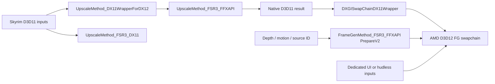

# AIO Build 18 FSR reverse-engineering notes

Date: 2026-10-01. Scope: offline static inspection requested by the user, using Ghidra 12.1.3 and Capstone 5.0.7. This is evidence for integration decisions, not source transplanted into TRP or a gameplay acceptance result.

## Binary identity and method

Input: `C:/Users/user/Downloads/SkyrimUpscalerAIOBuild18-Hotfix1.7z` (204,178,443 bytes).
Archive SHA-256: `136cbacda0d75373ad47e07c6017924edaaddbda063abaeb53f7e30734076af8`.

| File | SHA-256 | File version observed locally |
| --- | --- | --- |
| `SKSE/Plugins/SkyrimUpscaler.dll` | `5ded74be9bccefe4cff12cdd93e87cd079c017b0500dd1c5ec3150eaf08f7f81` | 1.0.2.0 |
| `UpscalerBasePlugin/PDPerfPlugin.dll` | `53b5068c01700aa1c6d551fce3827cf23f0cc3cf9f543737e6c6166a2ff441d1` | No file version resource observed |
| `amd_fidelityfx_loader_dx12.dll` | `2f36843c3bb8c059621c10574e586a883ef337f2a549c67ecf3a82b3959ac238` | 2.1.0.604 |
| `amd_fidelityfx_framegeneration_dx12.dll` | `3f5e674a59b400756e98ef31fd583a4eb08ad567ec8dee362886bc96e55ed347` | 4.0.0.604 |
| `amd_fidelityfx_upscaler_dx12.dll` | `2604c0b392072d715b400b2f89434274de31995a4b6e68ce38250ebbd3f6c5fc` | 4.0.2.0 |

The archive also supplies a legacy D3D11 backend (`ffx_backend_dx11_x64.dll`, `ffx_fsr3upscaler_x64.dll`, `ffx_fsr3_x64.dll`) and multiple NVIDIA/Intel runtimes. Local Authenticode inspection reports a valid signature on the AMD loader/FG DLLs above, and NotSigned on the supplied upscaler/monolithic/legacy DLLs. These observations do not establish their provenance or actual selected providers. TRP's plan retains the official SDK 2.3.0 pin; its runtime package and per-DLL hashes still require local verification during implementation.

7-Zip extracted files only to ignored research output. PE import/export/section metadata, focused strings, `.pdata` bounds, decoded RIP references, RTTI vtables, and targeted decompilation were examined. Capstone candidates were decoded before recording them; Ghidra independently recovered the named backend classes and virtual methods. Some main-plugin regions produced decompiler warnings; no claim of complete game-hook recovery is made.

Ghidra imported/decompiled `SkyrimUpscaler.dll` and `PDPerfPlugin.dll` successfully. The initial main-plugin pass covered 21 string-linked functions; the helper passes covered 54 selected functions and 87 vtable/helper targets, followed by focused wrapper/callback inspection. All target addresses below are RVAs in the exact `PDPerfPlugin.dll` hash above, image base `0x180000000`. They are not universal hook addresses.

No supplied DLL was executed, no live process was attached, and no executable, installed game, MO2 profile, or renderer setting was patched. No third-party binaries or decompiled bodies are published with these notes.

## Architecture recovered

The FSR implementation is primarily in `PDPerfPlugin.dll`; the main plugin supplies game integration and UI/configuration. Its exported `EvaluateUpscaler` and `EvaluateFrameGeneration` delegate to separate virtual slots on an API owner, rather than implementing the algorithms in their export bodies.

The diagram summarizes static class/call/resource relationships; it does not assert that every combination is valid or that a particular runtime path was exercised.

| Role | RVA / static evidence |
| --- | --- |
| Dynamic FFX API acquisition | `0xcc8c0`: GetModuleHandleW/GetProcAddress for the five API functions, with separate tables for monolithic, loader, and graphics API variants. |
| Active function-table selection | `0xccc80`: selects a table by graphics API and backend selection; D3D12 selection 4 chooses the loader table. |
| D3D11 legacy FSR creation/dispatch | `0xfe2e0` / `0xfedc0`: backend interface/context creation and `ffxFsr3ContextDispatchUpscale` resource assembly. |
| D3D12 wrapper constructor/evaluation | `0xcf080` / `0xd0cb0`: RTTI `UpscaleMethod_DX11WrapperForDX12`, shared-resource work and inner upscaler dispatch. Vtable at `0x11a82d8`. |
| FFX API SR constructor/create/dispatch | `0x1003e0` / `0x100620` / `0x100b70`; vtable at `0x11ac300`. |
| SR elapsed-time measurement | `0xffe70`: QPC/frequency multiplied by the double 1000.0 at `0x11acb48`, with GetTickCount fallback. |
| FG constructor/context | `0xee680` / `0xee870`; RTTI `FrameGenMethod_FSR3_FFXAPI`, vtable at `0x11a9f28`. |
| AMD FG swapchain for HWND | `0xefc80`: FFX API DX12 swapchain creation descriptor and returned inner swapchain. |
| FG prepare/configure/UI registration | `0xef230`: PrepareV2, matching source ID in FG configuration, swapchain UI configuration. |
| FG generation callback | `0xef880`: invokes the selected FFX dispatch pointer, then reports generated output counts/resources. |
| D3D11-facing Present | `0xe6830`, slot 8 of `DXGISwapChainDX11Wrapper` vtable `0x11a8e40`. |
| Command-slot wait/reset | `0x73410`: recorded per-work/per-slot fence wait precedes allocator/list reset. |
| CPU retirement wait | `0x6fdf0`: completion/device-loss checks followed by an infinite event wait. |

The bundled INI explicitly distinguishes native D3D11 FSR 3.1 (selection 3), D3D12 interop upscaling (selection 4), and separate FG selection (0 none, 1 FSR, 2 DLSS, 3 XeSS). These are AIO's settings, not TRP's numeric meanings: TRP's DLAA remains 3. AIO's labels and DLL presence are not proof of an actual analytical/ML provider identity.

## SR parameter evidence

`0x100b70` builds an upscale dispatch descriptor of type `0x10001` and calls the dynamic dispatch slot. Resource order and scalar offsets match the inspected FFX C upscaler descriptor. The following mapping describes the recovered helper input structure, not a Skyrim global layout:

| Dispatch field | Recovered input/source |
| --- | --- |
| Command list | Input structure `+0x68` |
| Color / depth / motion | `+0x08` / `+0x18` / `+0x10`, passed through API-specific resource wrapping |
| Native output | `+0x30`, falling back to `+0x28` |
| Exposure | Null resource in this path; create flags and pre-exposure still matter |
| Reactive mask | Resource from `+0x20`; optional absence is possible |
| Transparency/composition mask | Null in this path |
| Jitter / motion scale | Two float pairs copied from `+0x44` / `+0x4c` |
| Render size | Float extents at `+0x38/+0x3c` converted to integers |
| Output size | Stored backend dimensions at `+0x1c/+0x20` |
| Sharpening | Backend/request control and sharpness from `+0x40` |
| Frame delta | Difference of the millisecond clock at `0xffe70` |
| Pre-exposure / view-space conversion | 1.0 in this recovered descriptor assembly |
| Reset | Input flag at `+0x54` |
| Camera | Near/far/FOV inputs around `+0x58/+0x5c/+0x60`, with a depth-convention branch |

This identifies which values are consumed. It does not establish the game's motion direction, Y convention, jitter inclusion, world scale, ENB color encoding, mask quality, or the camera producer's correctness. Those remain capture/validation requirements in TRP's spec. Do not copy numeric motion scales or pre-exposure defaults from this table as universal values.

## Interop and FG evidence

The D3D11-to-D3D12 SR wrapper copies resources, signals a shared D3D11 fence, obtains a reusable D3D12 command list, calls the inner upscaler's dispatch method, submits, and enqueues a D3D11 consumer wait. Capstone verified the context-interface calls at `0xd12e5` (vtable `+0x498`, Signal), `0xd15b5` (`+0x4a0`, Wait), and `0xd1a68` (another producer Signal). The installed Windows SDK 10.0.26100.0 `d3d11_3.h` independently confirms these ID3D11DeviceContext4 slots (147 and 148 on x64). These witnesses establish static ordering in the inspected branch; producer flushing and complete reader lifetime still require runtime verification.

Command slots use recorded completion values before reset (`0x73410`). AIO also has cross-adapter/bounce support and branches for external/late resources. TRP's first milestone deliberately uses one physical adapter and must not inherit those branches or their queue assumptions.

The FG context creation at `0xee870` chains descriptor type `0x2000e`, while prepare at `0xef230` uses `0x2000c`. In the pinned SDK C headers these identify the FG version extension and PrepareV2. The source ID from helper input `+0x98` is written into both prepare and FG configuration. Depth/motion must exist and prepare succeed before the inspected path enables generation; reset/re-entry state can keep it disabled.

FG has a real AMD D3D12 swapchain context created through the FFX API (`0xefc80`) and a D3D11-facing wrapper. It does not implement AMD FG by reinterpreting a D3D11 swapchain pointer. The generation callback (`0xef880`) records dispatch through the dynamic API table and feeds output resource/count diagnostics back to the wrapper.

UI swapchain configuration at `0xef230` uses flags 2 or 3. The inspected SDK header defines bit 1 as internal UI double buffering and bit 0 as premultiplied alpha. This is concrete evidence of buffering/alpha choices, but the main-plugin point where UI drawing finishes and the flag producer's alpha semantics have not been fully recovered. A non-null UI pointer alone is still insufficient.

## Decisions for TRP

1. The existing spec's same-adapter interop plus separate presentation policies remains justified. AIO shows both a direct D3D11 route and a D3D12 bridge; it does not eliminate TRP's requirement for NVIDIA-free startup/presentation.
2. Continue with official SDK 2.3.0 typed C descriptors/provider queries. Its C API header version is distinct from the actual chosen analytical SR 3.1.5 provider. AIO's older loader/component versions and hard-coded labels do not replace provider discovery/actual-provider reporting.
3. Add QPC-derived millisecond delta, finite-input guards, absent-mask handling, output consumption, and completed-UI buffering to the planned tests using TRP contracts. Do not transplant AIO's globals, class offsets, fallback rules, exposure constants, or selector values.
4. Preserve progress-aware retirement and device-loss diagnostics. The recovered infinite waits at `0x6fdf0` and in the SR wrapper are not the recovery policy selected for TRP.
5. FSR FG remains the later stage: matching source IDs, version extension/PrepareV2, a D3D12 presenter, one pacing owner, completed UI, and callback/resource retirement. Static analysis cannot prove frame multiplication, physical cadence, image quality, or GPU compatibility.

## Local evidence and reproducibility

Worktree research root: `C:/Users/user/.codex/worktrees/fsr-sr/DvaKolbas/out/research`.

* `aio-build18-inventory.json`: all 21 DLL hashes, versions, local signature results.
* `aio-triage/pe_inventory.json`, `plugin_xrefs.json`, `perf_xrefs.json`: PE data and decoded string references.
* `aio-triage/ghidra-fsr.txt`: main-plugin targeted decompilation.
* `aio-triage/ghidra-perf.txt`: initial helper report; SHA-256 `abf8129d1b8e95a7522ee4807589959df322a4e5db6486f6c69a4425c8678d44`.
* `aio-triage/ghidra-perf-expanded.txt`: wrapper/backend vtable methods; SHA-256 `9b46ec09a60d5c37b0a3c40cce6111b266bdb641242e5e43965213cca3847cec`.
* `aio-triage/ghidra-perf-follow.txt`, `perf-vtables-expanded.txt`: callbacks, factory, timing, and vtable witnesses.
* `aio-triage/perf-wrapper-disasm.txt`: Capstone byte-level confirmation; SHA-256 `a5809147040ebc72cd15a4a65e59f40f18e4f1bd0d32a23ad4dc9e21027afa2a`.
* `scripts/aio_triage.py`, `aio_disasm.py`, `AioFsrReport.java`, `AioFsrVtables.java`: local analysis utilities. Raw output/binaries remain ignored.

Executed tools: 7-Zip archive list/extraction, PowerShell SHA-256/AuthentiCode/file-version inventory, `C:/Python314/python.exe` PE/Capstone utilities, Ghidra headless import and `-process PDPerfPlugin.dll -noanalysis` follow-up scripts with JDK 26.0.1 and `-max-cpu 2`. Successful final Ghidra commands exited 0 and saved their reports/projects. Ghidra rejects project paths containing a dot-prefixed element; projects therefore reside under the primary workspace's `out/research/ghidra-project`, while scripts/reports remain in the managed worktree.

Official declarations inspected at commit `60f4ea81909200d8542eca14dccb2628b763a9a3`:

* [FFX C API](https://github.com/GPUOpen-LibrariesAndSDKs/FidelityFX-SDK/blob/60f4ea81909200d8542eca14dccb2628b763a9a3/Kits/FidelityFX/api/include/ffx_api.h).
* [Upscale descriptors](https://github.com/GPUOpen-LibrariesAndSDKs/FidelityFX-SDK/blob/60f4ea81909200d8542eca14dccb2628b763a9a3/Kits/FidelityFX/upscalers/include/ffx_upscale.h).
* [FG version/PrepareV2/UI declarations](https://github.com/GPUOpen-LibrariesAndSDKs/FidelityFX-SDK/blob/60f4ea81909200d8542eca14dccb2628b763a9a3/Kits/FidelityFX/framegeneration/include/ffx_framegeneration.h).

No live-runtime validation, renderer implementation, or game deployment occurred during this RE pass. The approved spec is unchanged; the implementation plan remains pending review and execution-method selection.
